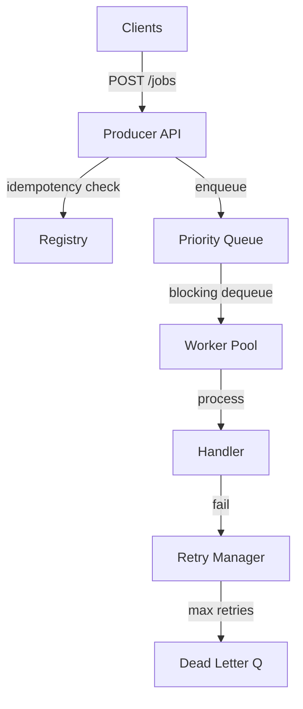

# JobQueue — Distributed Job Queue in Go

A high-performance, in-process distributed job queue system built in Go. This project demonstrates advanced concurrency patterns, reliable execution guarantees, and resilient system design.

[](https://goreportcard.com/report/github.com/paymybills/JobQueue)
[](https://opensource.org/licenses/MIT)

---

## Key Features

*   **High Concurrency**: Leverages Go goroutines with fine-grained control using `sync.Mutex` and `sync.Cond` for efficient resource utilization.
*   **Priority-Based Processing**: Jobs are processed based on their assigned priority level.
*   **Execution Guarantees**: 
    *   **At-least-once**: Automatic retries for transient failures.
    *   **Exactly-once**: Idempotency registry prevents duplicate job processing.
*   **Backpressure Management**: Bounded queue capacity with HTTP 503 signaling to prevent system overload.
*   **Resilient Retries**: Exponential backoff with jitter to reduce downstream contention.
*   **Dead Letter Queue (DLQ)**: Failed jobs are quarantined for manual inspection and replay.
*   **Monitoring & Metrics**: Built-in HTTP endpoints for system health and job statistics.

---

## Architecture

For a deep dive into the design decisions, component interactions, and execution guarantees, see the **[Architecture Deep Dive](docs/ARCHITECTURE.md)**.

### System Overview


---

## Getting Started

### Prerequisites

*   [Go 1.18+](https://golang.org/dl/)

### Running the System

```bash
# Clone the repository
git clone https://github.com/paymybills/JobQueue.git
cd JobQueue

# Run the demo
go run main.go
```

The system will start and automatically:
1.  Seed 15 demo jobs.
2.  Demonstrate idempotency key rejection.
3.  Test backpressure by flooding the queue.
4.  Print periodic performance statistics.

---

## API Reference

### Submit a Job
```bash
curl -X POST http://localhost:8080/jobs \
  -H "Content-Type: application/json" \
  -d '{
    "payload": "process-order-42",
    "idempotency_key": "order-42",
    "priority": 5,
    "max_retries": 3
  }'
```

### Check Job Status
```bash
curl http://localhost:8080/jobs/<job-id>
```

### View Dead Letter Queue
```bash
curl http://localhost:8080/dlq
```

### Retry a Dead Lettered Job
```bash
curl -X POST http://localhost:8080/dlq/<job-id>/retry
```

### System Metrics
```bash
curl http://localhost:8080/metrics
```

---

## Implementation Details

*   **Concurrency**: Uses `sync.Cond` for efficient blocking dequeues (parked goroutines consume zero CPU).
*   **Idempotency**: Implemented via a thread-safe registry with `sync.RWMutex` to optimize for high-frequency reads.
*   **Worker Pool**: Fixed-size pool of workers using a pluggable handler architecture.
