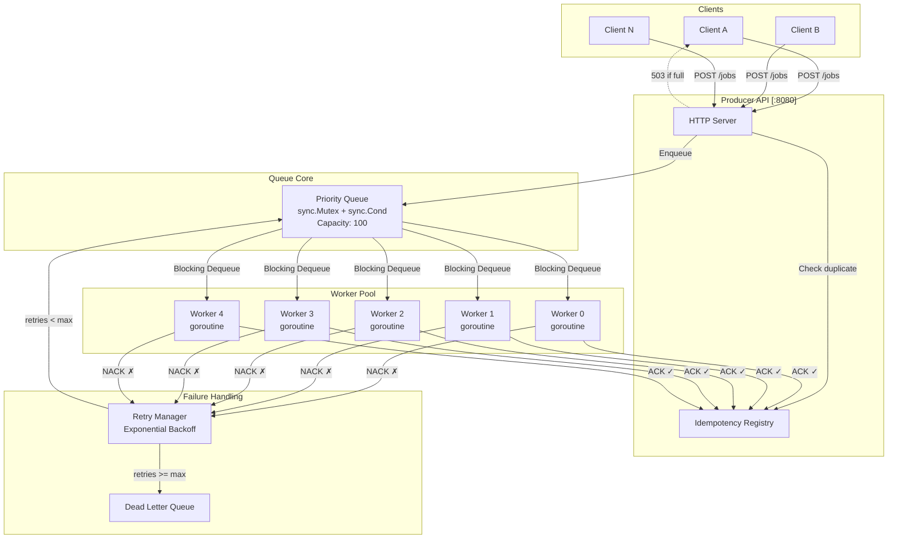
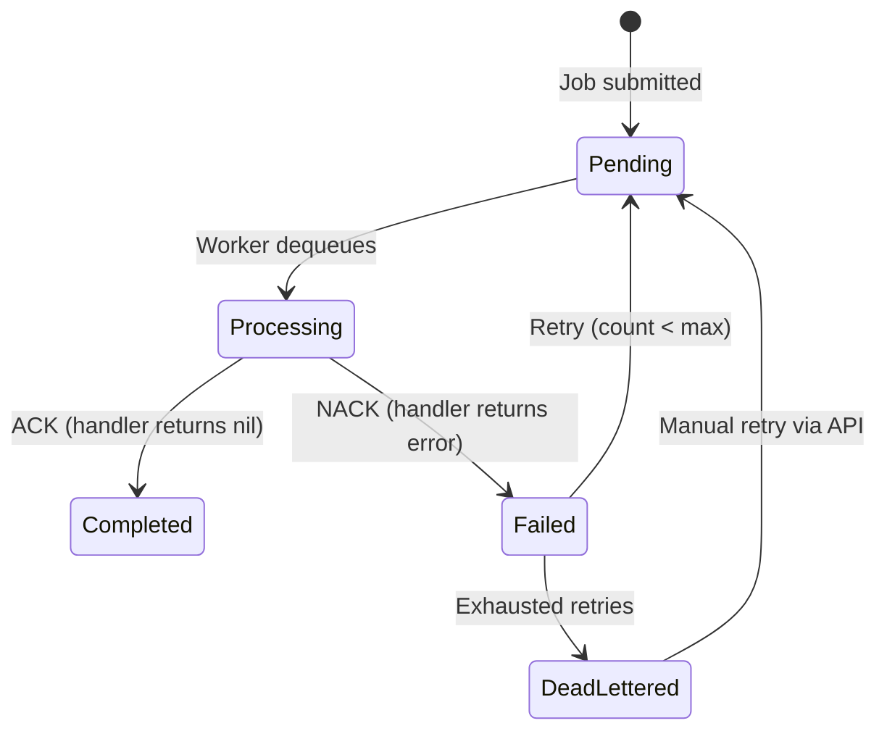
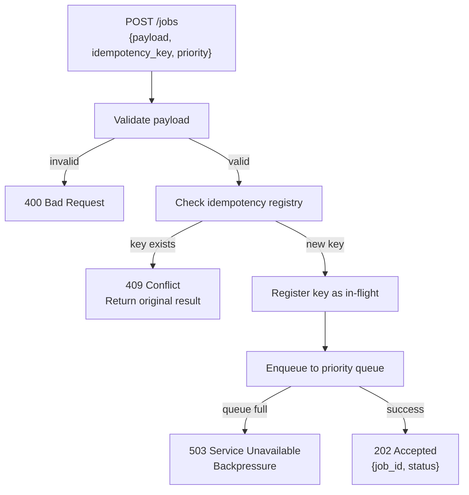
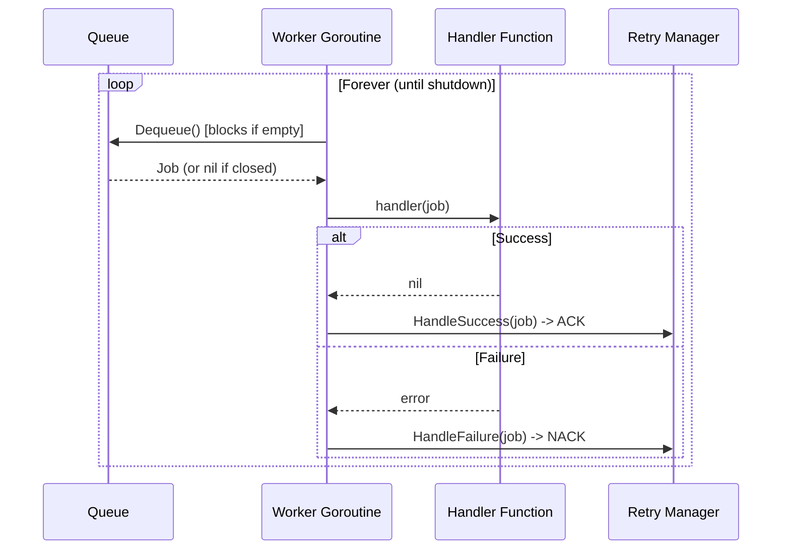
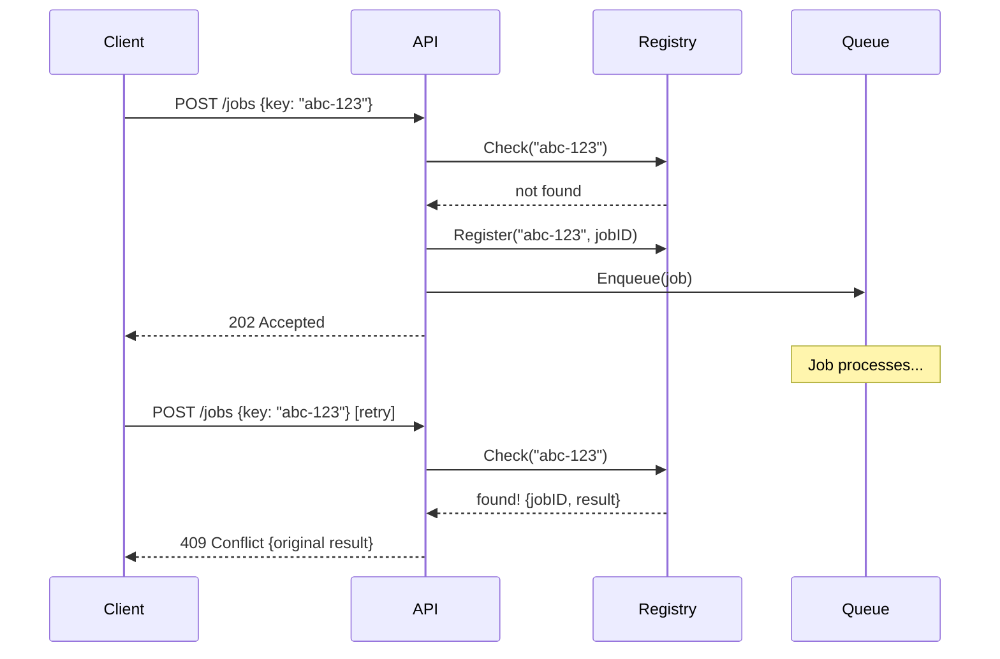
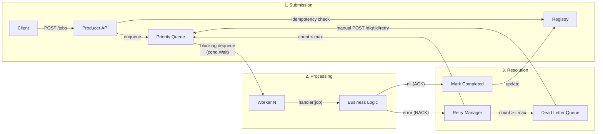

# Distributed Job Queue — Architecture Deep Dive

A production-oriented, in-process job queue built in Go, demonstrating async system design, failure handling, backpressure, worker pools, and execution guarantees.

---

## System Overview



---

## Job Lifecycle State Machine

Every job follows this deterministic state machine. There are no ambiguous states.



| State | Meaning |
|-------|---------|
| `PENDING` | In queue, awaiting pickup |
| `PROCESSING` | Held by a worker goroutine |
| `COMPLETED` | Successfully processed (terminal) |
| `FAILED` | Handler errored; may be retried |
| `DEAD_LETTERED` | All retries exhausted (terminal unless manually replayed) |

---

## Component Breakdown

### 1. The Queue — `pkg/queue/queue.go`

**What it does:** Thread-safe priority queue with blocking dequeue and capacity-based backpressure.

**How it works:**

```
┌─────────────────────────────────────────────────┐
│                  Queue Internals                 │
│                                                  │
│  ┌──────────┐   ┌──────────────────────────┐    │
│  │ sync.Mu  │──>│ jobs []  (sorted by pri) │    │
│  │  tex     │   └──────────────────────────┘    │
│  └──────────┘                                    │
│  ┌──────────┐                                    │
│  │sync.Cond │──> Wait() / Signal() / Broadcast()│
│  └──────────┘                                    │
│  maxSize = 100  ← backpressure threshold         │
└─────────────────────────────────────────────────┘
```

**Key mechanisms:**

- **`sync.Mutex`** protects all reads and writes to the job slice. Only one goroutine can modify the queue at a time.
- **`sync.Cond`** enables **blocking pops**. When a worker calls `Dequeue()` and the queue is empty:
  1. `cond.Wait()` atomically releases the mutex and parks the goroutine (zero CPU)
  2. When `Enqueue()` adds a job, it calls `cond.Signal()` to wake exactly one parked worker
  3. The woken worker re-acquires the mutex and proceeds
- **Priority ordering**: Jobs are sorted on insert (higher number = higher priority). Workers always get the most urgent job first.
- **Backpressure**: `Enqueue()` returns an error when `len(jobs) >= maxSize`. The producer API translates this to an HTTP 503.

**Why not channels?**

| Feature | Channels | Mutex + Cond |
|---------|----------|--------------|
| Priority ordering | ✗ FIFO only | ✓ Custom sort |
| Dynamic backpressure | ✗ Fixed buffer | ✓ Configurable |
| Introspection (stats, size) | ✗ Opaque | ✓ Full access |
| Blocking pop | ✓ Built-in | ✓ via `cond.Wait()` |
| Simplicity | ✓ Idiomatic | ✗ More code |

We chose mutex+cond to demonstrate low-level concurrency control and because channels can't do priority ordering.

---

### 2. Producer API — `pkg/producer/producer.go`

**What it does:** HTTP interface for job submission with idempotency enforcement and backpressure signaling.

**Request flow:**



**Why 202 Accepted (not 200 OK)?** The job is *accepted for processing*, not *processed*. This is correct async API semantics — the client should poll `GET /jobs/:id` for the result.

**Why 409 for duplicates?** Returning the original result for a duplicate idempotency key is the standard pattern. The client doesn't need to know whether this is the first or fifth time it sent the request.

---

### 3. Worker Pool — `pkg/worker/pool.go`

**What it does:** Fixed pool of N goroutines, each running an independent dequeue→process→ack/nack loop.

**How it works:**



**One goroutine per worker — why?**

- Each goroutine is ~8KB of stack (grows as needed). 5 workers = ~40KB. Trivial.
- Goroutines are scheduled by the Go runtime onto OS threads via M:N scheduling. We get parallelism without managing thread pools ourselves.
- `context.Context` + `sync.WaitGroup` gives us clean shutdown: cancel the context → close the queue → `Broadcast()` wakes all sleeping workers → they see `nil` from `Dequeue()` → they return → `WaitGroup.Wait()` unblocks.

**Pluggable handlers:** Workers don't know what jobs do. They call `HandlerFunc(job) error`. You can swap in any processing logic.

---

### 4. Retry Manager — `pkg/retry/retry.go`

**What it does:** Decides whether a failed job gets retried or dead-lettered. Calculates backoff delays.

**Backoff formula:**

```
delay = min(baseDelay × 2^attempt + jitter, maxDelay)
```

**Example progression (baseDelay=500ms, maxDelay=10s):**

| Attempt | Base Delay | With Jitter (approx) |
|---------|-----------|----------------------|
| 1 | 1s | 750ms – 1.25s |
| 2 | 2s | 1.5s – 2.5s |
| 3 | 4s | 3s – 5s |
| 4 | 8s | 6s – 10s |
| 5+ | 10s (capped) | 7.5s – 10s |

**Why jitter?** Without jitter, if 100 jobs fail at the same time, they all retry at exactly `t+1s`, then `t+3s`, recreating the exact spike that caused the failure. Jitter spreads them out randomly.

**NACK flow:**
```
NACK received
  ├── retryCount < maxRetries?
  │     └── YES → RequeueWithDelay(job, backoff)
  │                  └── goroutine sleeps for delay, then re-enqueues
  └── NO → DLQ.Add(job)
              └── Job is permanently shelved
```

---

### 5. Dead Letter Queue — `pkg/dlq/dlq.go`

**What it does:** Holds jobs that have exhausted all retry attempts.

**Why it exists:**
- Without a DLQ, permanently failing jobs would either: (a) retry forever (starving the queue), or (b) silently disappear (data loss).
- The DLQ provides **observability** — operators see what's failing and why.
- **Manual replay**: `POST /dlq/:id/retry` lets operators fix the root cause and requeue.

**Production pattern:** In real systems, DLQ alerts trigger PagerDuty alerts. If DLQ grows, something is structurally wrong.

---

### 6. Idempotency Registry — `pkg/idempotency/registry.go`

**What it does:** Maps idempotency keys to job results, preventing duplicate processing.

**How it enables exactly-once:**



**Why `sync.RWMutex`?** Reads (duplicate checks) vastly outnumber writes (registrations). `RLock()` allows unlimited concurrent reads; `Lock()` is only needed for writes.

---

## Execution Guarantees

### At-Least-Once Delivery

**Mechanism:** Jobs are only removed from the queue when dequeued. If a worker crashes mid-processing, the job was already removed — but the NACK path won't fire, so it's lost. This is the inherent tradeoff of an in-memory system.

**In production:** Persistent queues (Redis, Kafka, Postgres) keep the message until an explicit ACK. Our system approximates this: if the handler returns an error (NACK), the job is requeued. The job may be processed multiple times — hence "at least once."

**Implication:** Your handlers should be **idempotent** — processing the same job twice should produce the same result.

### Exactly-Once Semantics (via Idempotency Keys)

**Mechanism:** The idempotency registry prevents the *same logical request* from creating duplicate jobs. This is exactly-once *from the client's perspective*.

**Important distinction:**
- **Exactly-once delivery** (queue to worker): Impossible in distributed systems without 2PC.
- **Exactly-once processing** (end-to-end): Achieved via idempotency keys. Same key = same result, regardless of how many times the client retries.

### The Production Reality

| Guarantee | How We Achieve It | Tradeoff |
|-----------|-------------------|----------|
| At-least-once | Retry on NACK | Requires idempotent handlers |
| Exactly-once (client) | Idempotency keys | Memory cost for registry |
| Ordering | Priority queue | Higher-priority jobs may starve lower ones |
| Durability | ✗ In-memory | Process crash = data loss |

---

## Backpressure

**Problem:** If producers submit faster than workers process, unbounded queues grow until OOM.

**Solution:** Bounded queue capacity:

```
Producer → [Queue: 100 slots] → Workers

         ┌─ slots available → 202 Accepted
Enqueue ─┤
         └─ queue full → 503 Service Unavailable
                          "slow down, try again later"
```

**Why let the client handle it?** The producer knows its own retry policy. Maybe it should:
- Retry with exponential backoff
- Drop the job
- Route to a different queue
- Buffer locally

We signal backpressure; the client decides the response.

---

## Data Flow: Complete Job Lifecycle



---

## Production Tradeoffs

### What This System Does Well
- **Demonstrates concurrency primitives**: mutex, cond vars, goroutines, context, WaitGroup
- **Clean separation of concerns**: each package has one job
- **Observable**: logs, metrics endpoint, DLQ inspection
- **Correct async API semantics**: 202 Accepted, polling for status

### What a Production System Would Add

| Concern | Our Approach | Production Approach |
|---------|-------------|---------------------|
| **Persistence** | In-memory (volatile) | Redis, Kafka, Postgres |
| **Horizontal scaling** | Single process | Distributed workers + message broker |
| **Monitoring** | Log output + `/metrics` | Prometheus + Grafana + alerting |
| **Idempotency TTL** | Grow forever | TTL-based expiry (e.g., 24h) |
| **Ordering** | Priority sort (O(n log n)) | Heap (O(log n)) or skip list |
| **Auth** | None | API keys, JWT, mTLS |
| **Rate limiting** | Backpressure only | Token bucket / sliding window |
| **Job scheduling** | Immediate | Delayed jobs, cron scheduling |

### Why Mutex+Cond Over Channels — The Full Picture

Channels are Go's idiomatic choice. We deliberately chose the mutex+cond path because:

1. **Priority queues need sorted access** — channels are strictly FIFO
2. **Backpressure needs introspection** — you can't check `len(ch)` and act atomically
3. **Learning value** — mutex+cond is the primitive underneath channels; understanding it deepens your Go knowledge
4. **Production queues use this pattern** — Redis, RabbitMQ, and SQS all use mutex-protected heaps internally

A channel-based alternative would use a buffered channel + goroutine fan-out, which is simpler but loses priority ordering and fine-grained backpressure control.

---

## Running the System

```bash
# Build and run
go run main.go

# Submit a job
curl -X POST http://localhost:8080/jobs \
  -H "Content-Type: application/json" \
  -d '{"payload":"process-order-42","idempotency_key":"order-42","priority":5,"max_retries":3}'

# Check status
curl http://localhost:8080/jobs/<job-id>

# View dead-lettered jobs
curl http://localhost:8080/dlq

# Retry a DLQ job
curl -X POST http://localhost:8080/dlq/<job-id>/retry

# System metrics
curl http://localhost:8080/metrics
```

On startup, the demo automatically:
1. Seeds 15 jobs with random priorities
2. Demonstrates idempotency key rejection
3. Floods the queue to trigger backpressure
4. Prints periodic stats showing queue drain, retries, and DLQ growth
